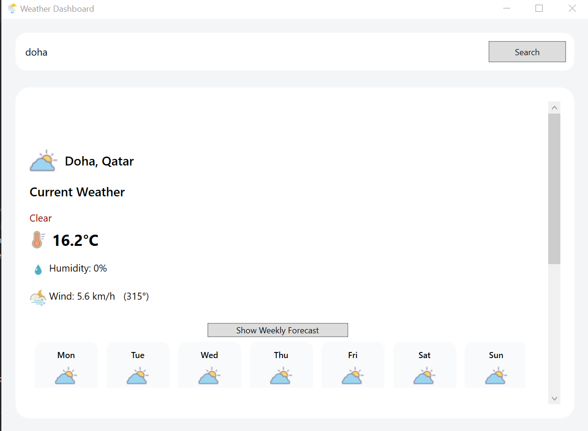
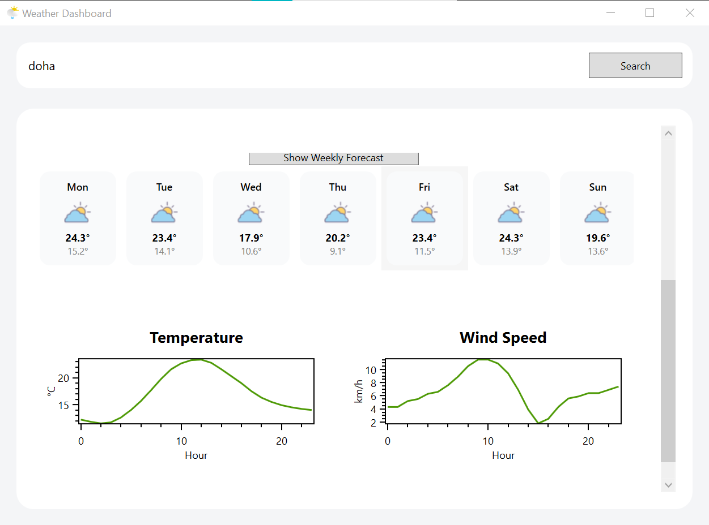

WeatherDashboard 🌦️
Overview

WeatherDashboard is a WPF desktop application built with the MVVM pattern that provides clear, interactive weather information for any supported city.
The app focuses on clean UI, smooth user experience, and reliable data handling.

It includes subtle UI animations on startup, interactive charts with hover details, and robust error handling to ensure a polished and professional feel.
_____________________________________________________________________________________________________________
API Providers

This project uses the Open-Meteo platform, which provides two separate public APIs:

🌍 Geocoding API (City Search)

Used to convert city names into geographic coordinates.

API Name: Open-Meteo Geocoding API

Base URL: https://geocoding-api.open-meteo.com/v1/

No API key required

☀️ Weather Forecast API

Used to fetch current, hourly, and daily weather data.

API Name: Open-Meteo Weather Forecast API

Base URL: https://api.open-meteo.com/v1/forecast/

No API key required

Both APIs are free, open, and do not require authentication.
______________________________________________________________________________________________________________
Features

🔍 City search using geocoding

🌡️ Current weather (temperature, wind, humidity*)

📆 7-day weekly forecast

📊 Daily temperature & wind plots (OxyPlot)

🖱️ Detailed data shown on chart hover

🎨 Animated welcome screen for a more engaging first launch

🧩 Modular UI using UserControls

⚠️ Graceful error handling with user notifications

📝 Logging for debugging and diagnostics

🌤️ Weather icon mapping based on weather codes

* Some values depend on API availability.                                                                                        ______________________________________________________________________________________________________________
## Screenshots
### Main Window

### current weather

### daily plot 

______________________________________________________________________________________________________________
Architecture

MVVM pattern

Clear separation of concerns:

Views – XAML UI

ViewModels – presentation logic & state

Models – data structures

Services – API communication

Helpers – logging, converters

Reusable UserControls for weekly forecast and plots

Assets folder for icons and visuals
______________________________________________________________________________________________________________
Technical Stack

.NET 7

WPF

OxyPlot 2.2

Open-Meteo APIs
______________________________________________________________________________________________________________
Notes on Data Availability

Some geographic regions may be inconsistently supported by third-party APIs.
To maintain neutrality, data consistency, and avoid misleading results, unsupported or inconsistently handled regions are filtered at the service level.

This is a technical decision only and does not represent any political position.
The project aims to remain neutral, respectful, and inclusive.

